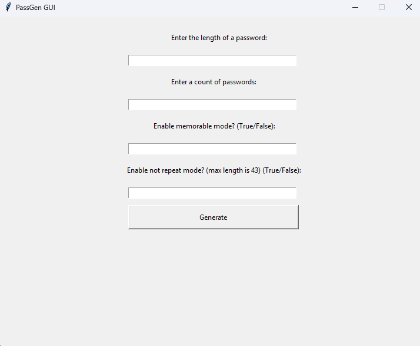

# 🔐 Python GUI Password Generator

A powerful password generator with a clean GUI, supporting memorable words, non-repeating characters, and customizable settings. Saves all passwords to a file for future reference.

## Features
- Generate multiple passwords at once
- Customize password length (2–512 characters)
- Memorable mode: include real words for easier recall
- Not-repeat mode: ensure no character repeats within a password
- Simple GUI built with Tkinter
- Saves generated passwords to `passwords.txt`
- Input validation with clear error messages

## Usage
1. Clone this repository:  
   `git clone <your-repo-url>`
2. Navigate to the project directory and run the GUI:  
   `python main.py`
3. Enter desired settings:
   - Password length
   - Number of passwords
   - Memorable mode (True/False)
   - Not-repeat mode (True/False)
4. Click **Generate** and see passwords appear in a new window.

## How it Works
- Takes input from the user via GUI
- Validates input limits for length and count
- Generates passwords according to selected modes:
  - Memorable mode: inserts words from a predefined list
  - Not-repeat mode: ensures unique characters per password
- Stores passwords in memory and writes them to `passwords.txt`
- Resets input fields after generation for the next run

## Notes
- Both “Memorable” and “Not-repeat” modes cannot be used together
- Maximum password length for non-repeating mode is limited by available characters
- Make sure to clear or close previous password windows if generating multiple times

## Ideas for Improvement
- Add password strength evaluation
- Allow custom wordlists for memorable mode
- Add clipboard copy button for generated passwords
- Include options for symbols, numbers, or uppercase/lowercase toggles

## Files
- `main.py` — main GUI and password generator launcher
- `generator.py` — password generation logic
- `passwords.txt` — stores generated passwords with timestamps
